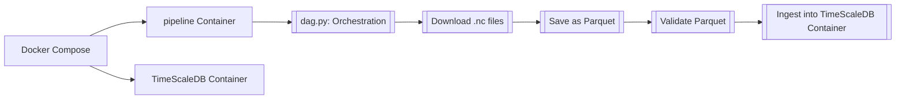
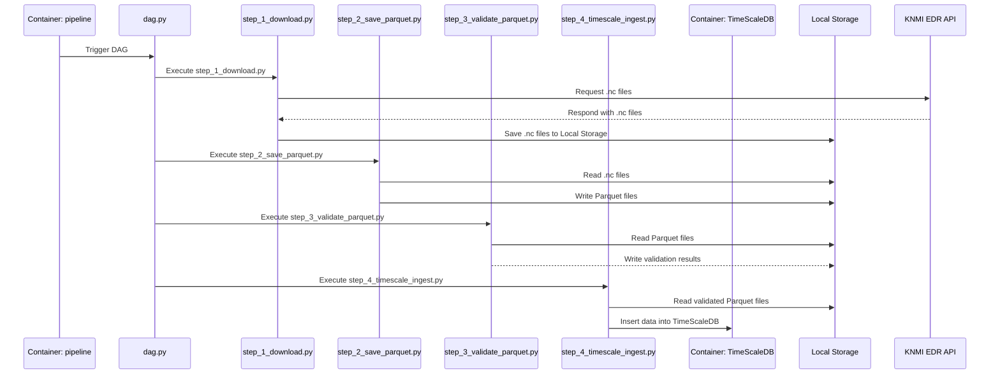

## Dataset KNMI EDR API - 10 minuten Actuele Data
This Dataset contains weather data collected every 10 minutes from the KNMI weather stations. I've added a 10 min. time-delay process at the end of the pipeline so that a temporary connection to the database can be made via port 5432:5432 as described in the compose.yaml file. At the moment, the simplified local_dag.py file is run by the pipeline. If deploying to Airflow via CI/CD, we can use the airflow_dag.py file and adjust it as necessary.

## Source of Dataset: KNMI EDR API - 10 minuten Actuele Data
KNMI collects observations from the automatic weather stations situated in the Netherlands and BES islands on locations such as aerodromes and North Sea platforms. In addition, wind data from KNMI wind poles are included. The weather stations report every 10 minutes meteorological parameters such as temperature, relative humidity, wind, air pressure, visibility, precipitation, and cloud cover. The number of parameters differs per station. The file for the past 10 minutes is available a few minutes later and contains a timestamp denoting the end of the observation period in UTC. It is possible that a station's observations may not be immediately available. Files are updated with missing data up to 4 hours later.

## Simplified Pipeline Diagram

## Extensive Pipeline Diagram

## Expected Deployment Environment
* Orchestration: AWS-managed Airflow
* Database: Snowflake
* Transformations: DBT

### Building and running the application
Clone the repository, install Docker, and start your application by running: `docker compose up --build`.

## Requirements:
* Write a robust pipeline to extract and transform data in Python from the following API
https://developer.dataplatform.knmi.nl/edr-api which contains the data set “Actuele 10
minuten data” and stores the data into a database system of your choice.
* Dockerize your code
* Create a stack (e.g. using docker compose) that includes your own container for the data
pipeline and the containers of the tools of your choice (database, orchestrator, etc). The
stack should include multiple containers. You have the freedom to choose what you think
is important.
* A visual diagram or high-level description of the architecture of a (modular) pipeline (e.g.
including a scraper; load step; ingest) including how it will be read, orchestrated and
stored.
* Provide instructions on how we can run your system on our laptops.
* Testing of data in TimeScaleDB

## Reasoning of choices
* For ingesting the Open API, I chose to use the templated code from KNMI. I chose it because it runs fast (asynchronous) and retrieves the last file. If I would spend more time on this, I would:
    * Create exponential back-off for network requests including the proper logging to a centralised log like Grafana, Datadog
    * Save this to an S3 Development server, so that the environment resembles production better
    * create a function to filter the files by date so this step can be parameterised in Airflow
    * create a verification function to double check if all files have been retrieved correctly, fileformats are conforming the expectations
    * create more extensive logging to catch network-related failures
    * create a function to read and temporarily store the hash of the swagger documentation, and notify the development team if the documentation has changed, so that future data format changes will be taken into account and can be solved immediately, next to subscribing to a source where updates to the APIs are announced before they are taken into effect.
* As the files are formatted in netCDF4-format, I've parsed this by using the xarray library with the netCDF4-engine, assign datatypes to the dataset, and rename the columnnames to business terms (should be verified with the users of the data). If I would have more time, I would:
    * Move the column-renaming to DBT, so that all transformations are made in one environment.
    * Resolve the issue of the last 4 columns not parsing the binary data correctly.
    * Create more extensive error-logging to make this process more robust.
* For the database, I choose to use TimeScale DB, because of it's fast ingestion time and efficient storage for time-series data. If I would have more time and would be developing within Vandebron, I would:
    * use the Snowflake Dev Database (which I expect exists)

## Thoughts and ideas for productionising
* Adding config for Dev, Test, Acc, Prod databases and file storage, and method to scrape data from API.
* Using Cloud Secrets Storage to store the API Key
* Using pre-commit hooks for identifying secrets stored in codebase, formatting to pep8, and triggering tests
* Creating a CI/CD pipeline which:
    * Goes through rigorous tests with a range of static test datasets, and validates the correct transformation of the input dataset (easier to write precise tests because the dataset doesn't change, and taking changes into account is already done by the swagger documentation checker and being subscribed to the source of the KNMI announcing changes)
    * Deployes to the Airflow Test Environment
    * Security vulnerability testing of the Snowflake image

## Making this dataset convenient for data scientists and MLops
* Versioning the datasets in the mart, to ensure reproducability for training
* Provide Snowflake views by requirements of Data Scientist taking into account:
    * If values are in different formats, convert them to 1 consistent format like:
    * Missing values
    * Outlier Detection and removal
    * Feature engineering by request of the Data Scientist e.g.:
        * Combining columns to create new features
        * Binning values
        * Extracting day of week from dates

## Recommended transformations to make it useful for Data Scientists:
* Only publishing datasets of at least 4 hours ago or longer to the historical dataset, since changes can be back-filled up to 4 hours later as described at (https://english.knmidata.nl/open-data/actuele10mindataknmistations)

### Timestamp standardisation:
* Different interval references (middle vs end) would cause incorrect time series analysis
* Mixing reference points could misalign weather events, could misrepresent sequentionality

### Wind Measurement Height Flagging
* Non-standard heights affect wind speed comparability, creating biases
* Distinguishing estimated vs direct measurements aids reliability assessment

### Station Type Indication:
* Offshore platforms, and BES Island stations have distinct weather patterns requiring separate analysis
* Station types indicate measurement context and potential biases

### Data quality flags:
* Missing measurement types limit analysis options, and uncorrected standard deviations affect uncertainty calculations
* Quality flags (composite DQ score per record and missing values) enable filtered analysis based on data reliability needs

## What works well already
* Docker network is getting spun up
* API is getting called to list files
* Retrieves most recent file
* Files are converted to parquet and stored on the shared volume

## Other missing features
Next to the aforementioned suggested improvements:
    * Periodic full-load and versioning of the table
    * Logging to a centralised logging solution such as Grafana, Datadog
    * Airflow task to periodically check the Swagger documentation to see if anything changed for calling the API
    * Rigorous testing

## Scalability
Scalability by metric:
* Data volume: Built to handle increased file loads linearly through TimeScaleDB's time-series optimisation
* Processing speed: Asynchronous API calls and parallel processing capabilities
* Storage efficiency: Parquet compression and TimeScaleDB's chunking reduce storage needs
* System resources: Container-based architecture enables horizontal scaling
* Historical data: Versioning and periodic full loads support growing historical datasets
* Concurrent users: TimeScaleDB supports multiple simultaneous query connections

## Robustness
What makes it robust:
* Exception logging

The current pipeline is not very robust yet, however with these key improvements, it could become robust:
* Error handling: Comprehensive exception handling for API calls, data parsing, and database operations
* Data validation: Quality checks at each pipeline stage
* Back-fill capability: 4-hour window for data corrections 
* Monitoring: Centralised logging for issue detection
* Recovery: Automated retries with exponential backoff
* Versioning: Historical data snapshots for recovery
* Documentation monitoring: Automated API spec change detection
* Enhanced network failure recovery
* Expanded data validation rules
* Comprehensive central logging system with severity levels and notifications to development team